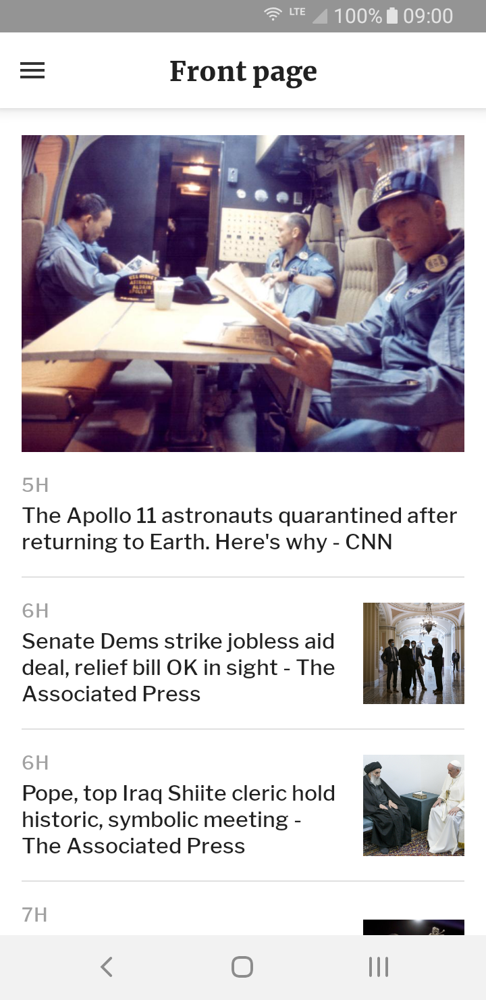
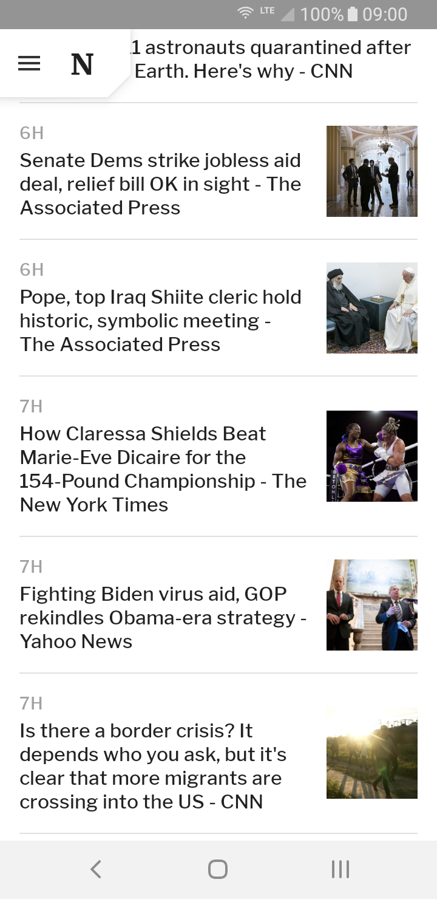
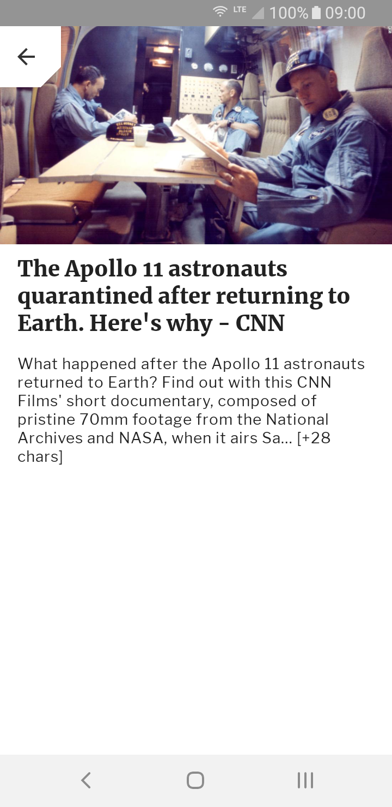

# Fortnightly

An app inspired by the [Fortnightly](https://material.io/design/material-studies/fortnightly.html) Google Material Design study.  

## Setup  

Add the [News API](https://newsapi.org/) key to your `local.properties` file in the project's root folder:  

```groovy  
newsApiKey=<value>  
```

## Preview


## Screenshots
<p>
  
  
  
</p>